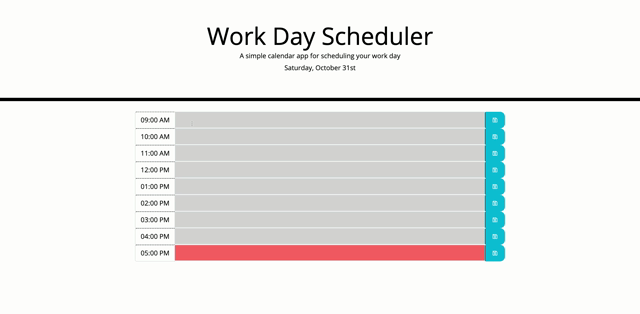

# WorkDayScheduler

### Description
* The purpose of this project is to create a workday schedule wherein tasks can be saved. As well, the hour blocks change color depending on the current time versus the time on the schedule. This project involved the use of moment.js to manage and manipulate date/time information. As well, the use of jquery assisted in shortening the amount of necessary code.   

### Demonstration
                                                                                                                                                          
 &nbsp;
                                                                                                                                                       

### Deployed Site

* https://stacyo23.github.io/WorkDayScheduler/

### Github Page

* https://github.com/stacyo23/WorkDayScheduler